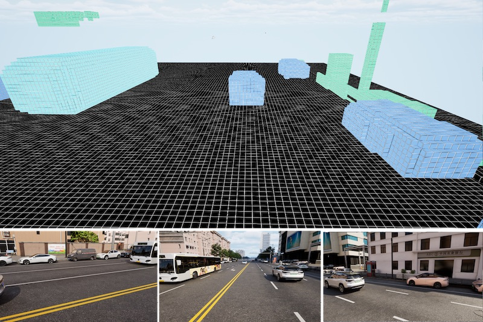
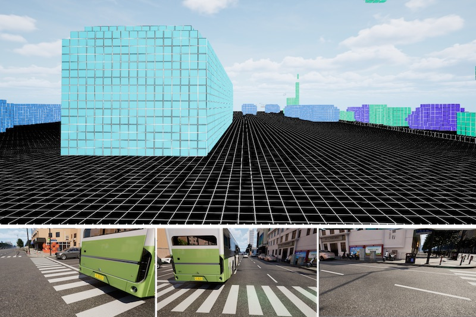
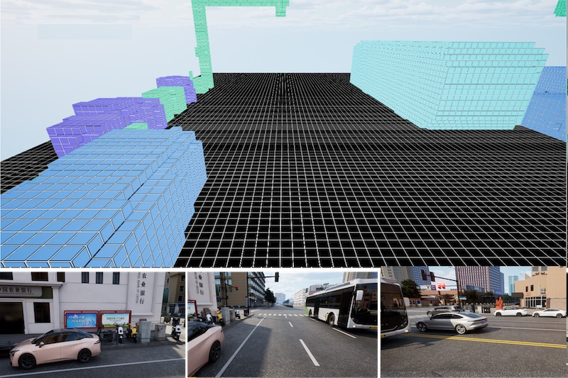
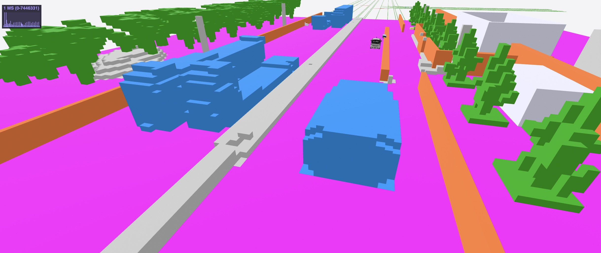

> [!IMPORTANT]
> 🌟 Stay up to date at [opendrivelab.com](https://opendrivelab.com/#news)!

<div id="top" align="center">

# LightwheelOcc
**A 3D Occupancy Synthetic Dataset in Autonomous Driving**

[](https://lightwheel.ai/)
[](https://lightwheel.ai/)


</div>

> - Point of Contact: [Lightwheel AI](mailto:contact@lightwheel.ai) or [Tianyu (李天羽)](mailto:litianyu@pjlab.org.cn)

## News
> :fire: China3DV Occupancy and Flow Challenge is ongoing! Check challenge [doc](/docs/challenge_china3dv.md)!

- **`2024/03/20`** LightwheelOcc dataset `v1.0` released.
- **`2024/03/01`** We are hosting CVPR 2024 Autonomous Grand Challenge and China3DV AD Challenge!

## Table of Contents
- [Introduction](#introduction)
- [Highlights](#highlights)
- [Data Overview](#data-overview)
  - [Basic Information](#basic-information)
  - [Data Sample](#data-sample)
- [Getting Started](#getting-started)
  - [Download Data](#download-data)
  - [Prepare Dataset](#prepare-dataset)
- [License and Citation](#license-and-citation)
- [Related Resources](#related-resources)


## Introduction
- LightwheelOcc, developed by Lightwheel AI, is a publicly available autonomous driving synthetic dataset. The dataset, which includes 40,000 frames and corresponding ground truth labels for a variety of tasks, is a generalized dataset that navigates a variety of regional terrains, weather patterns, vehicle types, vegetation, and roadway demarcations.
- Lightwheel AI levers generative AI and simulation to deliver 3D, physically realistic and generalizable synthetic data solutions for autonomous driving and embodied AI. By publishing LightwheelOcc, we aim to advance research in the realms of computer vision, autonomous driving and synthetic data.

## Highlights
- **Diverse data distributions, including corner cases and hard scenarios**

  - By incorporating complex traffic flows, LightwheelOcc contains diversified simulation of different traffic conditions and driving behaviors. Apart from usual scenarios, the dataset also presents corner cases like small and rare objects on the road, challenging conditions like nighttime and rainy scenes, etc. , enriching real-world data diversity.

<div align="center">
  
  
  
</div>

- **Accurate and dense 3D occupancy and depth label**

- **Realistic sensor configuration simulating nuScenes dataset**


## Data overview
### Basic Information
- The LightwheelOcc dataset contains 40,000 frames, totaling 240,000 images, of which 28,000 frames are used for training scenarios, 6000 frames are used for validation scenarios, and 6000 frames are used for testing scenarios.
- LightwheelOcc includes 6 camera sensor data, as well as labels for different tasks, including 3D Occupancy, Flow and Depth Map.

### Data Sample
| **3D Occupancy**    | **Depth Map**            |
|---------------------|--------------------------|
|  |  |

<p align="right">(<a href="#top">back to top</a>)</p>

## Getting Started
- [Download Data](/docs/getting_started.md#download-data)
- [Prepare Dataset](/docs/getting_started.md#prepare-dataset)

<p align="right">(<a href="#top">back to top</a>)</p>

## License and Citation

The LightwheelOcc dataset is under [CC BY-NC-ND 4.0](https://creativecommons.org/licenses/by-nc-nd/4.0/) license.
All assets and code within this repository are under the [Apache 2.0](/LICENSE.txt) license unless specified otherwise.

If this work is helpful for your research, please consider citing the following BibTeX entry.
```
@misc{lightwheel2024,
  title={LightwheelOcc: A 3D Occupancy Synthetic Dataset in Autonomous Driving} ,
  author={LightwheelAI and LightwheelOcc contributors},
  howpublished={\url{https://github.com/OpenDriveLab/LightwheelOcc}},
  year={2024}
}
```

<p align="right">(<a href="#top">back to top</a>)</p>

## Related Resources
- [DriveAGI](https://github.com/OpenDriveLab/DriveAGI)
- [OccNet](https://github.com/OpenDriveLab/OccNet) | [OpenScene](https://github.com/OpenDriveLab/OpenScene)

<p align="right">(<a href="#top">back to top</a>)</p>
