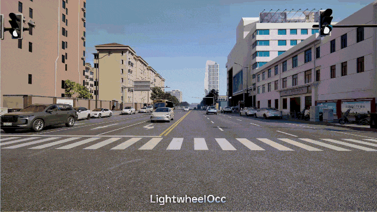

# LightwheelOcc
<div id="subtitle" align="center">A 3D Occupancy Synthetic Dataset in Autonomous Driving</div>

<div id="top" align="center">

</div>

English | [简体中文](./README_cn.md)

## Changelog

## Table of Contents
- [LightwheelOcc](#lightwheelocc)
  - [Changelog](#changelog)
  - [Table of Contents](#table-of-contents)
  - [1. Highlights](#1-highlights)
  - [2. Introduction](#2-introduction)
  - [3. Data Overview](#3-data-overview)
    - [3.1 Basic Information](#31-basic-information)
    - [3.2 Data Sample](#32-data-sample)
    - [3.3 Data Distribution](#33-data-distribution)
    - [3.4 Test and Results](#34-test-and-results)
    - [3.5 Best Practice](#35-best-practice)
  - [4. Getting Started](#4-getting-started)
    - [4.1 Download Data](#41-download-data)
    - [4.2 Prepare Dataset](#42-prepare-dataset)
  - [5. License \& Citation](#5-license--citation)
  - [6. Contact Us](#6-contact-us)

## 1. Highlights
**Diverse data distributions, including corner cases and hard scenarios**

By incorporating complex traffic flows, LightwheelOcc contains diversified simulation of different traffic conditions and driving behaviors. Apart from usual scenarios, the dataset also presents corner cases like small and rare objects on the road, challenging conditions like nighttime and rainy scenes, etc. , enriching real-world data diversity.
<div align="center">
  
  
  
</div>

## 2. Introduction
- LightwheelOcc, developed by Lightwheel AI, is a publicly available autonomous driving synthetic dataset . The dataset, which includes 40,000 frames and corresponding ground truth labels for a variety of tasks, is a generalized dataset that navigates a variety of regional terrains, weather patterns, vehicle types, vegetation, and roadway demarcations.
- Lightwheel AI levers generative AI and simulation to deliver 3D, physically realistic and generalizable synthetic data solutions for autonomous driving and embodied AI. By publishing LightwheelOcc, we aim to advance research in the realms of computer vision, autonomous driving and synthetic data.

## 3. Data Overview
### 3.1 Basic Information
- The LightwheelOcc dataset contains 40,000 frames, totaling 240,000 images, of which 30,000 frames are used for training scenarios, 5000 frames are used for validation scenarios, and 5000 frames are used for testing scenarios.
- LightwheelOcc includes 6 camera sensor data, as well as labels for different tasks, including 3D Occupancy and Depth Map.
- The dataset comprises 18 classes. Classes 0 - 16 have the same definition with the [nuScenes-lidarseg](https://github.com/nutonomy/nuscenes-devkit/blob/fcc41628d41060b3c1a86928751e5a571d2fc2fa/python-sdk/nuscenes/eval/lidarseg/README.md) dataset. The label 17 category denotes voxels that are unoccupied, referred to as [free]. The voxel semantics for each sample are provided in the labels.npz file as [semantics].

| **Type**          | **Info**                     |
|-------------------|------------------------------|
| Train             | 30000 frames                 |
| Validation        | 5000 frames                  |
| Test              | 5000 frames                  |
| Number of Cameras | 6                            |
| Number of Images  | 240,000                      |
| Voxel Size        | 1600x900                     |
| Range             | [-40, -40, -1.0, 40, 40, 5.4]|
| Classes           | 18 (without ignore)          |
| Labels            | 3D Occupancy and Depth Map   |

  
### 3.2 Data Sample
| **3D Occupancy**    | **Depth Map**            |
|---------------------|--------------------------|
|  |  |

### 3.3 Data Distribution
<table>
  <tr>
    <th>Category</th>
    <th>Class</th>
    <th>Distribution</th>
  </tr>
  <tr>
    <td rowspan="3">By Map Type</td>
    <td>Urban</td>
    <td>68%</td>
  </tr>
  <tr>
    <td>Suburbs</td>
    <td>9%</td>
  </tr>
  <tr>
    <td>Freeways</td>
    <td>23%</td>
  </tr>
  <tr>
    <td rowspan="2">By Lighting Conditions</td>
    <td>Daytime</td>
    <td>87%</td>
  </tr>
  <tr>
    <td>Nighttime</td>
    <td>13%</td>
  </tr>
  <tr>
    <td rowspan="3">By Weather Types</td>
    <td>Sunny</td>
    <td>45%</td>
  </tr>
  <tr>
    <td>Overcast</td>
    <td>38%</td>
  </tr>
  <tr>
    <td>Rainy or After Rain</td>
    <td>17%</td>
  </tr>
</table>

### 3.4 Test and Results
This experiment uses OccNet for training, and the results are provided for reference.

| **Train**                 | **Val**                   | **mIoU**       |
|---------------------------|---------------------------|----------------|
| nuScenes                  | nuScenes + LightwheelOcc  |   15.61        |
| nuScenes + LightwheelOcc  | nuScenes + LightwheelOcc  |   28.77        |
| nuScenes                  | nuScenes                  |   24.84        |
| nuScenes + LightwheelOcc  | nuScenes                  |   26.97        |


### 3.5 Best Practice
Generally, when training data, it is critical to check three key indicators, so as to determine the training method based on their performance:
1. Whether the labels of real data and synthetic data are aligned:  label alignment of synthetic data usually refers to whether the labels are consistent with those in the real-world dataset. If not aligned, the model may not be able to distinguish each category correctly.
2. Whether the number of real data and synthetic data is comparable: The volume of data determines the adequacy of model training. Insufficient data volume may lead to overfitting, while a large amount of data can improve the model's generalization ability.
3. Whether synthetic data is corner case or generic data: The data type (such as corner case or generic data) affects the model's generalization ability and sensitivity to specific situations.

The above issues must be comprehensively considered to ensure the model performance, when selecting training methods and data sampling strategies.
As for LightwheelOcc, the labels have been aligned, and the amount of real data is greater than that of the synthesized data, aiming at solving the corner case problem. Therefore, we recommend using a hybrid training approach, which involves mixing the synthesized and real data for direct training.

## 4. Getting Started
### 4.1 Download Data
- Google Drive: To be released
- BaiduNetdisk:  To be released
- OpenDataLab: To be released

### 4.2 Prepare Dataset
- Directory structure
```
LightwheelOcc
├── data/
│   ├── nuscenes/
│   │   ├── maps/
│   │   ├── samples/
│   │   ├── sweeps/
│   │   ├── v1.0-test
│   │   ├── v1.0-trainval
│   │   ├── nuscenes_infos_temporal_train.pkl
│   │   ├── nuscenes_infos_temporal_val.pkl   
│   ├── Occpancy3D-nuScenes-V1.0/
│   ├── lightwheel_occ
│   │   ├── lightwheel_occ_infos.pkl
│   │   ├── depth
│   │   │   ├── CAM_BACK
│   │   │   │   ├── 00b638f5-ef65-44f0-95f2-29caae0bc4ea
│   │   │   │   │   ├── 1710101555.452797.png
│   │   │   │   │   ├── ...
│   │   │   │   ├── ...
│   │   │   ├── ...
│   │   ├── samples
│   │   │   ├── CAM_BACK
│   │   │   │   ├── 00b638f5-ef65-44f0-95f2-29caae0bc4ea
│   │   │   │   │   ├── 1710101555.452797.jpeg
│   │   │   │   │   ├── ...
│   │   │   │   ├── ...
│   │   │   ├── ...
│   │   ├── occupancy
│   │   │   ├── 00b638f5-ef65-44f0-95f2-29caae0bc4ea
│   │   │   │   │   ├── 1710101555.452797.npz
│   │   │   │   │   ├── ...
│   │   │   │   ├── ...
│   │   │   ├── ...
```
- *imgs/* contains images captured by various cameras.
- *depth/* contains depth map of each sample. 
- *lightwheel_occ_infos.pkl* contains meta infos of the dataset.
- *labels.npz* contains *semantics*, *mask_lidar*, and *mask_camera* for each frame.
```
annotations {
    "train_split": ["scene-0001", ...],                         <list> -- training dataset split by scene_name
    "val_split": list ["scene-0003", ...],                      <list> -- validation dataset split by scene_name
    "scene_infos" {                                             <dict> -- meta infos of the scenes    
        [scene_name]: {                                         <str> -- name of the scene.  
            [frame_token]: {                                    <str> -- samples in a scene, ordered by time
                    "timestamp":                                <str> -- timestamp (or token), unique by sample
                    "camera_sensor": {                          <dict> -- meta infos of the camera sensor
                        [cam_token]: {                          <str> -- token of the camera
                            "img_path":                         <str> -- corresponding image file path, *.jpg
                            "intrinsic":                        <float> [3, 3] -- intrinsic camera calibration
                            "extrinsic":{                       <dict> -- extrinsic parameters of the camera
                                "translation":                  <float> [3] -- coordinate system origin in meters
                                "rotation":                     <float> [4] -- coordinate system orientation as quaternion
                            }   
                            "ego_pose": {                       <dict> -- vehicle pose of the camera
                                "translation":                  <float> [3] -- coordinate system origin in meters
                                "rotation":                     <float> [4] -- coordinate system orientation as quaternion
                            }                
                        },
                        ...
                    },
                    "ego_pose": {                               <dict> -- vehicle pose
                        "translation":                          <float> [3] -- coordinate system origin in meters
                        "rotation":                             <float> [4] -- coordinate system orientation as quaternion
                    },
                    "gt_path":                                  <str> -- corresponding 3D voxel gt path, *.npz
                    "next":                                     <str> -- frame_token of the previous keyframe in the scene 
                    "prev":                                     <str> -- frame_token of the next keyframe in the scene
                }         
        }
    }
}
```
## 5. License & Citation
This dataset is provided by Lightwheel AI LIMITED, who reserves all rights. No reproduction or republication without written permission.
```
@article{lightwheel2024,
 title={LightwheelOcc: A Synthetic Occupancy Dataset in Autonomous Driving},
  author={Lightwheel AI LIMITED},
  year={2024}
}
```

## 6. Contact Us
**Website** [https://lightwheel.ai/]

**Contact**: [contact@lightwheel.ai]

If you are interested or have any questions, feel free to contact us.
